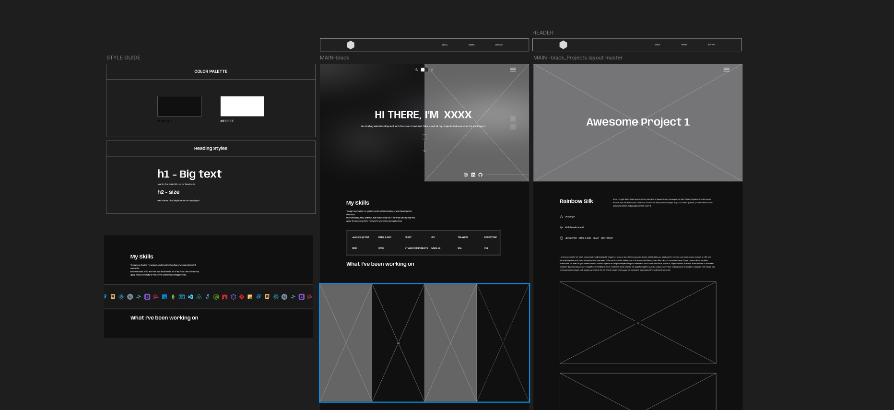
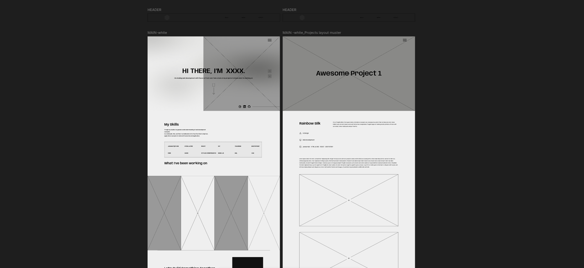

# My Portfolio Website

This is my personal portfolio website, built from scratch to showcase a selection of my projects.

I made a deliberate choice to build this little static site using **Vanilla JavaScript** and **Sass** instead of a front-end framework. This approach allows me to demonstrate foundational understanding of core web technologies and keeps the project lightweight and performant.

## Wireframes

Basic wireframes were designed in Figma to plan layout and interactions:

  

## Implemented Features  

-  **Dynamic Project Page Generation:** It safely inject project data into a single page, eliminating the need for separate HTML files for each project.
-  **Dynamic SEO Generation:** Updates page title, meta description, Open Graph tags an the fly for each project to improve search engine optimization and social link previews.
-  **Error Handler** Handles content or data errors gracefully to prevent the app from breaking.

-  **Fading Light/Dark Mode**

-  **Smooth Animations**

-  **Custom Breakpoints** for responsiviness

-  **Frontend Form Validation**

-  **Navigation Modal**

-  **SweetAlert Modal**

-  **Page Loader**

-  **Infinite Scroll for Skills**

## Tooling / Stack

| Layer      | Tools / Technologies Used       |
|-----------|--------------------------------|
| Markup     | HTML5                          |
| Styling    | SASS (Sass)                    |
| Language   | Vanilla JavaScript             |
| Design     | Figma                          |
| Animations | CSS Transitions & Keyframes    |

